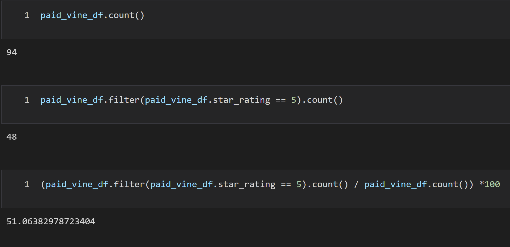
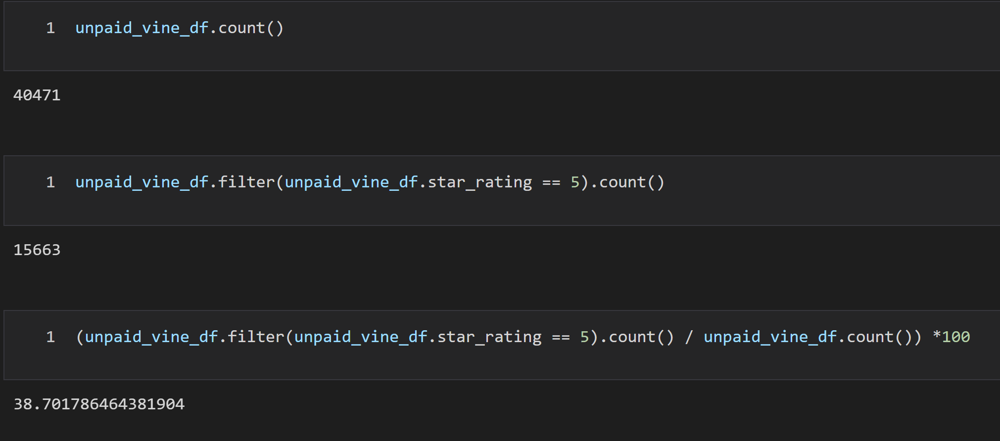

# Amazon_Vine_Analysis

## Overview
The purpose of this project was to create an AWS Postgres database, and to populate the data base using video game review data from Amazon.  The data was then analyzed to determine whether paid reviews lef to positivity bias. 

## Results:

### How many Vine reviews and non-Vine reviews were there?
There were 94 Vine reviews and 40,471 non-Vine reviews

### How many Vine reviews were 5 stars? How many non-Vine reviews were 5 stars?
There were 48 5 star Vine reviews and 15,663 5 star non-Vine reviews.

### What percentage of Vine reviews were 5 stars? What percentage of non-Vine reviews were 5 stars?
51.06% of Vine reviews were 5 stars and 38.7% of non-Vine reviews were 5 stars

## Summary: 
With paid reviews nearly 13% more likely to get a 5 star review, it does appear that there is positivity bias. We should perform the same analysis on all star levels to help confirm this.